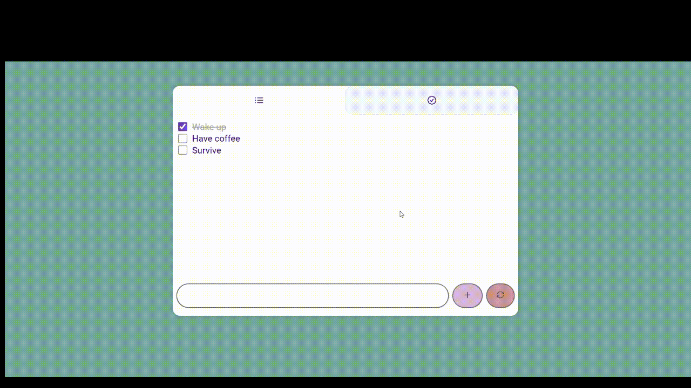
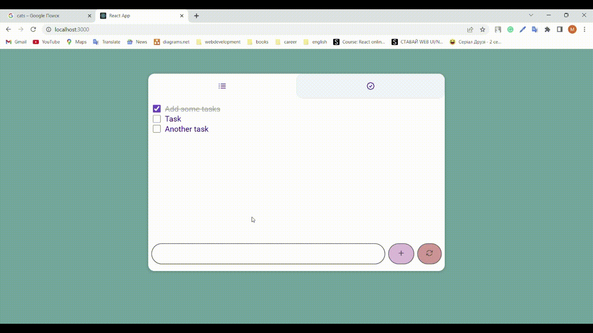

# Nice little To Do List

Basically, it's a little app which looks like your personal list of goals.
You can add your goal like this:

Also, you can switch to the list of completed tasks only, to congratulate yourself.

You can clean up your list if you've done all your tasks or just have no desire to do them anymore. Before actually doing it, you will see a warning.

In addition, you don't have to keep the list always open - just open the tab again when needed.

